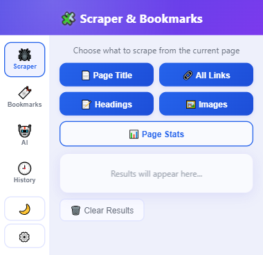
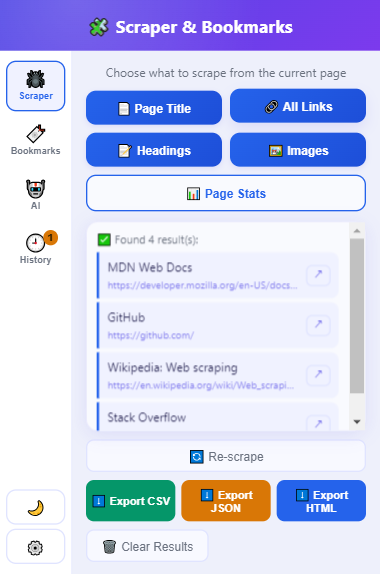
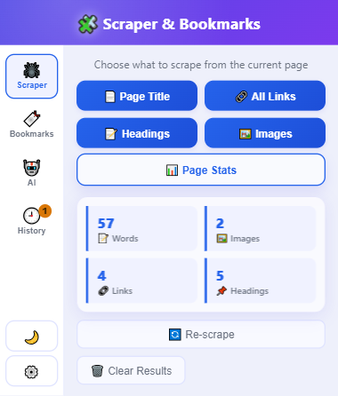
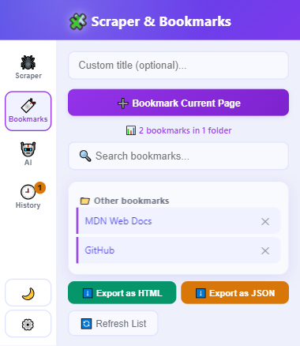
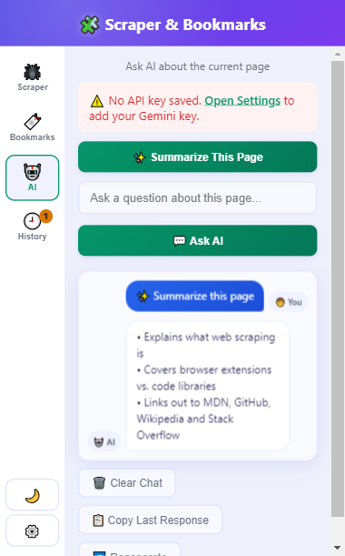
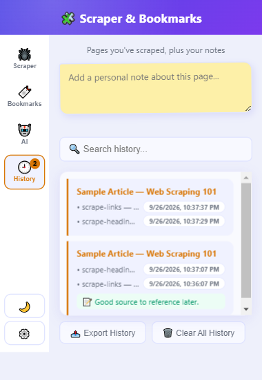
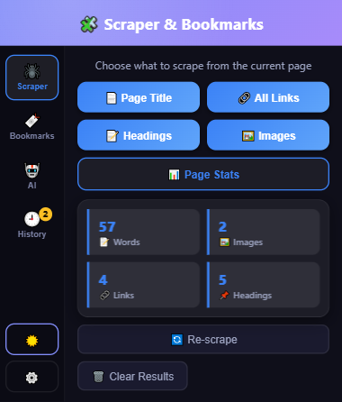
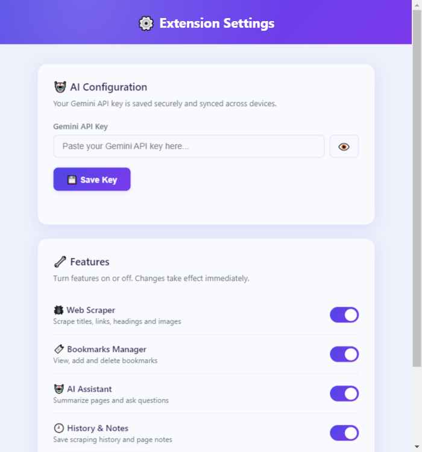

# Chrome Scraper & Bookmark Manager

A Chrome Extension that scrapes active tab data, summarizes pages using Gemini AI, and manages bookmarks — all from your browser toolbar, wrapped in a premium dark-navy UI.

---

## Features

- 🕷️ **Web Scraper** — grab the page title, links, headings or images, plus a one-click 📊 Page Stats summary card (word/image/link/heading counts) and a 🔄 Re-scrape shortcut. Exports to CSV, JSON or HTML.
- 🔖 **Bookmarks Manager** — view, add, search and delete bookmarks, with a live bookmark/folder count and an Enter-to-add shortcut. Exports to HTML or JSON.
- 🤖 **AI Assistant** — summarizes the current page or answers questions about it via the Gemini API, with full chat history, a page-context word counter, 📋 copy-last-response, and 🔁 regenerate.
- 🕘 **History & Notes** — auto-saves scrape history per page with a searchable, exportable list and a sticky-note-style textarea for personal notes.
- ⚙️ **Settings page** — manage your Gemini API key and toggle any feature on/off.
- Sidebar navigation, glassmorphism cards, and a light/dark theme toggle (🌙/☀️) — the popup remembers whichever tab and theme you last used.

---

## Screenshots

<table>
<tr>
<td><br/><sub>Scraper</sub></td>
<td><br/><sub>Scraped links (clickable)</sub></td>
<td><br/><sub>📊 Page Stats</sub></td>
</tr>
<tr>
<td><br/><sub>Bookmarks</sub></td>
<td><br/><sub>AI chat</sub></td>
<td><br/><sub>History &amp; notes</sub></td>
</tr>
<tr>
<td><br/><sub>Dark mode</sub></td>
<td><br/><sub>Settings</sub></td>
<td></td>
</tr>
</table>

---

## Tech Stack

- JavaScript (ES6+)
- Chrome Extension API
- Gemini API
- HTML & CSS

---

## Getting Started

1. Clone the repo — `git clone https://github.com/AhmadIqbal-1021/chrome-scraper-bookmark-manager.git`
2. Open Chrome and go to `chrome://extensions/`
3. Enable **Developer mode** (top right toggle)
4. Click **Load unpacked**
5. Select the project folder

---

## Project Structure

```
chrome-scraper-bookmark-manager/
├── manifest.json
├── popup.html
├── popup.js
├── popup.css
├── content.js
├── options.html
├── options.js
├── options.css
├── theme.css
├── tests.js
├── screenshots/
└── icon128x128.png
```

Run the test suite by opening the popup, right-clicking it → **Inspect**, and pasting the contents of `tests.js` into the Console tab.

---

## Author

**Muhammad Ahmad Iqbal**  
[LinkedIn](https://www.linkedin.com/in/ahmad-iqbal-961373317) · [GitHub](https://github.com/AhmadIqbal-1021)
